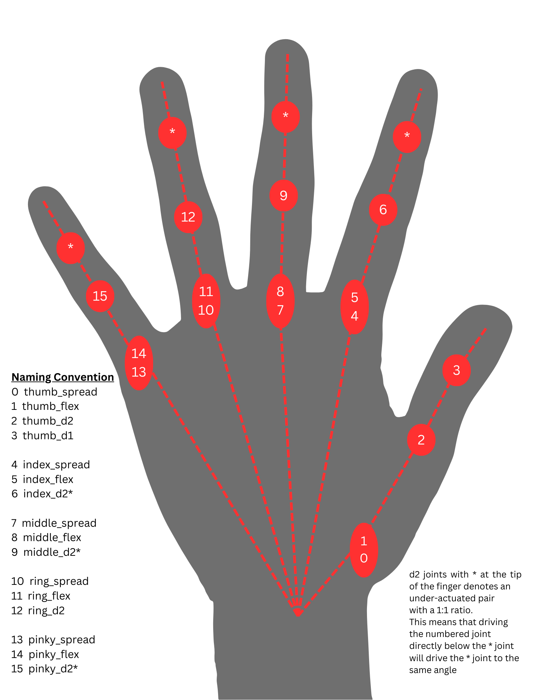

# [Artus Lite](/ArtusAPI/robot/artus_lite/data/Artus%20Lite.pdf)

see [data>Artus Lite Quick Start PDF (Wiring Diagram)](/ArtusAPI/robot/artus_lite/data/Artus%20Lite.pdf).

see [data>Artus Lite Technical Specification PDF](/ArtusAPI/robot/artus_lite/data/Artus%20Lite%20Technical%20Specification%20Sheet.pdf).

## Power Requirement

The Artus Lite should be connected to a 24 VDC power supply, requiring a maximum instantaneous draw of 200W, minimum 48W and typical 100W.

## Communication Methods

Hands are shipped at default with USB communication enabled unless otherwise specified.

## Hand Joint Map
Below is a Joint index guide mapped to a normal human hand with the naming convention and joint indices of the hand for control purposes.

## Startup Procedure
On Startup, the user must always run a `wake_up` command.

Afterwards, if all joints are at their starting position, then the system does not need to run a `calibration` before sending target commands. 

The Artus Lite also utilizes the `reset_on_start` which opens the hand when receiving the `wake_up` function, bypassing the need for `calibration`.

## LED States
Here is a detailed table of the LED states during normal operation and a description of the states.
| LED Colour | Description |
| --- | --- |
| Blue | Power on |
| Green | Idle (Ready to connect, ready for commands) |
| Red | Error state |
| Orange/Yellow | Shutdown/Sleep mode, may require power cycle for parameter changes to take effect |
| Purple | Flashing Actuators |

__A note about Joint Limits__

* D2, D1 and Flex joints have a range of [0,90]
* Spread joints are normally [-17,17] with the thumb being the exception [-40,40]
* For spreading, the positive spread value will be towards the right hand thumb, negative spread value is towards the pinky

