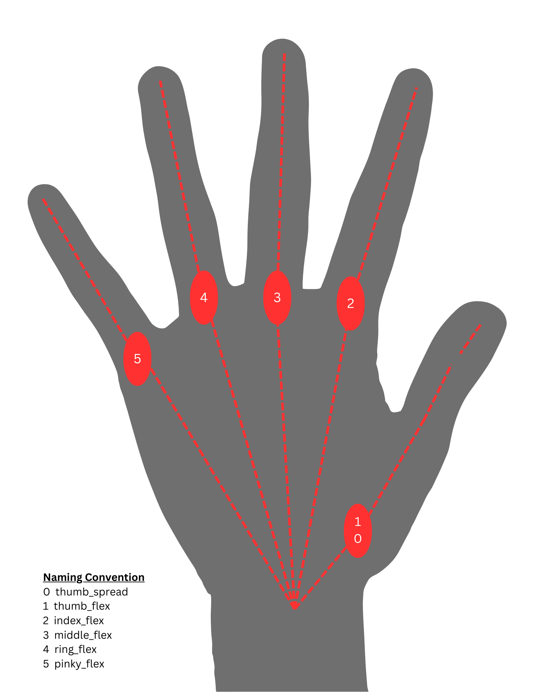

# Artus Talos

see [data>Getting Started](data/Talos%20Getting%20started.png) for __Wiring__.

## Power Requirements

The Artus Talos runs off a 24 VDC power supply, with a nominal power draw of 35W, 100W maximum draw, and 6W at idle.

## Communication Methods

Hands are currently only shipped with RS485. USBC to come. 

## MODBUS RTU
The system utilizes MODBUS RTU communication protocol. 

* See the [ModbusMap PDF](data/ModbusMap_Talos_r1.pdf) if you are developing your own communication application.

## Hand Joint Map
Below is a Joint index guide mapped to a normal human hand with the naming convention and joint indices of the hand for control purposes.

## Startup Procedure
On Startup, the user must always run a `wake_up` command.
The robot needs to then run a `calibration` command before sending target commands. 

__A note about Joint Limits__
* Thumb spread joint has a range of [-45,45]
* All Flex joints have a range of [0,90]
* For thumb spread, positive is towards the palm, and negative is away.

