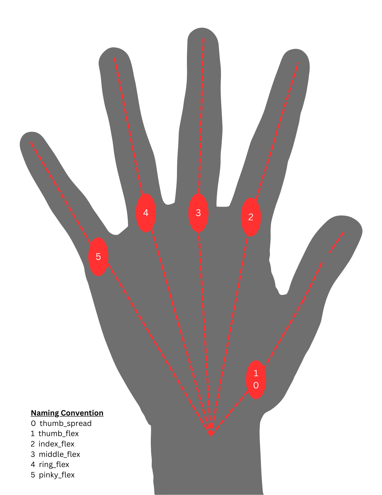

# Artus Talos

Everything needed to wire, power, and command the ARTUS Talos hand. For general API usage (installing the library, `set_joint_angles`, feedback), see the [main repository README](/README.md) and [API Functionality](/docs/API%20Functionality.md) — this file covers what's specific to this hand model.

## Reference Documents
* [Getting Started (Wiring)](data/Talos%20Getting%20started.png)
* [ModbusMap PDF](data/ModbusMap_Talos_r1.pdf) — if you are developing your own communication application.

## Table of Contents
* [Safety](#safety)
* [Power Requirements](#power-requirements)
* [Communication Methods](#communication-methods)
* [Startup Procedure](#startup-procedure)
* [Shutdown Procedure](#shutdown-procedure)
* [Hand Joint Map](#hand-joint-map)
* [Joint Limits](#joint-limits)
* [Default Speed and Force Values](#default-speed-and-force-values)
* [LED States](#led-states)

## Safety
>[!IMPORTANT]
>The hand contains pinch points at every joint. Keep fingers, hair, and loose clothing clear while powered, and never reach into the hand while it is executing a motion command. Disconnect power immediately if a joint behaves unexpectedly.

## Power Requirements

The Artus Talos runs off a 24 VDC power supply, with a nominal power draw of 35W, 100W maximum draw, and 6W at idle.

## Communication Methods

Hands are shipped with USBC and RS485 capabilities.

The system utilizes the MODBUS RTU communication protocol. See the [ModbusMap PDF](data/ModbusMap_Talos_r1.pdf) for register-level detail if you are developing your own communication application.

## Startup Procedure
On Startup, the user must always run a `wake_up` command.

>[!IMPORTANT]
>Unlike ARTUS Lite, Talos **requires** a `calibrate()` call after `wake_up()` before it will accept target commands.

## Shutdown Procedure
See [2.2 Normal Shutdown Procedure](/README.md#22-normal-shutdown-procedure) in the main repository README — the sequence is the same across all ARTUS hands.

## Hand Joint Map
Below is a joint index guide mapped to a normal human hand, with the naming convention and joint indices used for control purposes.

<div align=center>

</div>

## Joint Limits

* Thumb spread joint has a range of [-55,55]
* All flex joints (thumb, index, middle, ring, pinky) have a range of [0,90]
* For thumb spread, positive is towards the palm, and negative is away.

## Default Speed and Force Values

| Parameter | Default | Range | Units |
|---|---|---|---|
| Velocity | 200 | 0 – 300 | degrees/second |
| Force | 16 | 2 – 40 | Newtons (N) |

They live as attributes on the robot model, not as hardcoded constants in the API:
```python
hand._robot_handler.robot.default_velocity  # 200
hand._robot_handler.robot.default_force     # 16
```

>[!IMPORTANT]
>`set_joint_angles()` does **not** auto-fill `target_velocity`/`target_force` when a joint's dictionary omits them — it only sends what you give it. If you want the nominal speed/force applied, read the two attributes above and merge them into your pose dict yourself before calling `set_joint_angles()`, the way [`general_example.py`](/examples/general_example/general_example.py) does. The one exception is `set_home_position()`, which applies `default_velocity` automatically when returning the hand to its home pose (it does not set `target_force`).

## LED States
Here is a detailed table of the LED states during normal operation and a description of the states.

| LED Colour | Description |
| --- | --- |
| Blue | Power on (Ready for Startup Sequence) |
| Green | Idle |
| Flashing Green | Active mode |
| Red/LED OFF | Error state |
| Orange/Yellow | Shutdown/Sleep mode, may require power cycle for parameter changes to take effect |
| Yellow | Flashing Actuators |
