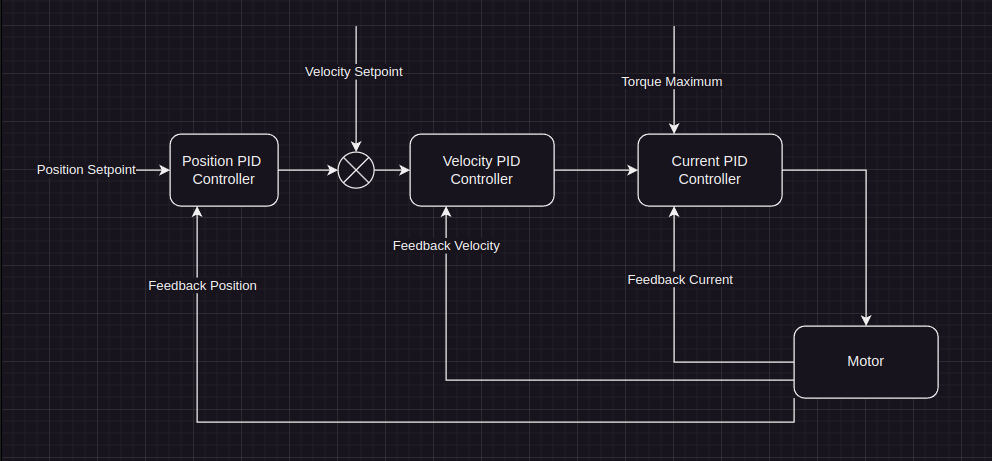

# Artus BLDC Driver

This file contains information on the core of our new products, our Brushless DC (BLDC) motor. This information pertains to the following systems:
* [Artus Scorpion](../artus_scorpion/ARTUS_SCORPION.md)
* [Artus Talos](../artus_talos/ARTUS_TALOS.MD)

## Startup
For systems using the Artus BLDC Driver, every time the system is powered on, it will require the following sequence.
1. send a `wake_up` command. This tells the drivers to do a calibration for proper commutation
2. send a `calibrate` command. This tells the drivers to do an end-stop calibration based on the respective system. It will then go to the start position. 

## Closed-loop Control
The system uses the following closed-loop control scheme, allowing position, velocity and torque control. For fingered systems, the joint targets are in the following units:

* Position : degrees
* Velocity : degrees/s
* Force : Newtons (N)
 

