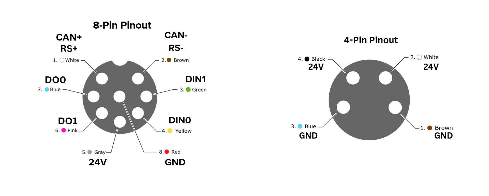
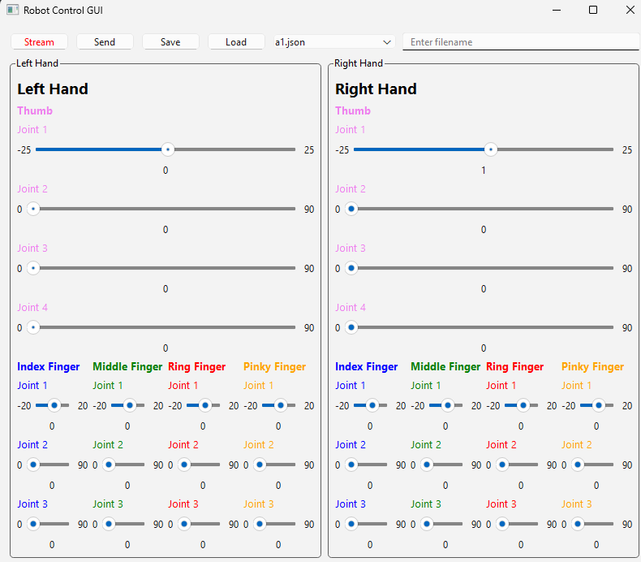

# Python ARTUS Robotic Hand API

This repository contains a Python API for controlling the ARTUS robotic hands by Sarcomere Dynamics Inc.
Please contact the team if there are any issues that arise through the use of the API. See [Software License](/Software%20License_24March%202025.pdf).

## Introduction
>__Please read through the entire README before using the ARTUS hand__

This repository contains the following:
* [ARTUS API](/ArtusAPI/)
* [ROS2 Node](/ros2/)
* [Examples](/examples/)

Below is a list of the ARTUS hand-specific READMEs that are compatible with the API. This includes _electrical wiring specifics_, _joint maps_ and more:
* [ARTUS Lite Information](/ArtusAPI/robot/artus_lite/README.md)

### VERY IMPORTANT
* [Requirements](#requirements)
* [Wiring Diagram](#wiring-diagram)
* [Normal Startup Procedure](#normal-startup-procedure)
* [Normal Shutdown Procedure](#normal-shutdown-procedure)

## Table of Contents
* [Getting Started](#getting-started)
    * [Wiring Diagram](#wiring-diagram)
    * [Requirements](#requirements)
    * [USB Driver](#usb-driver)
    * [Installation](#installation)
    * [Running example.py](#running-examplepy)
    * [Video Introduction](#video-introduction)
* [API Usage in Custom Application](#api-usage-in-custom-application)
    * [Creating an ArtusAPI Class Object](#creating-an-artusapi-class-object)
    * [Serial Example](#serial-example)
    * [Normal Startup Procedure](#normal-startup-procedure)
* [Interacting with the API](#interacting-with-the-api)
    * [Setting Joints](#setting-joints)
        * [Input Units](#input-units)
    * [Getting Feedback](#getting-feedback)
    * [SD Card Interactions](#sd-card-intersactions)
    * [Changing Communication Methods between RS485, USBC, CANBus](#changing-communication-methods)
    * [Controlling Multiple Hands](#controlling-multiple-hands)
    * [Special Commands](#special-commands)
    * [Teleoperation Considerations](#teleoperation-considerations)
* [Directory Structure](#directory-structure)
* [Artus Lite Control Examples Setup Videos](#artus-lite-control-examples-setup)
    * [General Example](#running-examplepy)
    * [GUI Setup](#1-gui-setup)
    * [ROS2 Node Control Setup](#2-ros2-node-control-setup)
    * [Manus Glove Setup](#3-manus-glove-setup)

## Getting Started

### Wiring Diagram
See below the wiring diagram with the circuit connection names and cable colours. You can use either the 8P nano M8 or the 4P nano M8. 

<div align=center>
  
</div>

### Requirements
Requires Python version >= 3.10 installed on the host system. Please visit the [Python website](https://www.python.org/downloads/) to install Python.

#### USB Driver
>[!NOTE]<br>
>If the host system cannot find the Artus Lite as a USB device once it is connected over USBC, go to [FTDI Driver Download](https://ftdichip.com/drivers/vcp-drivers/) to install the virtual COM port driver (usually only required for Windows). 

### Installation
Using pip:
```bash
pip install psutil
pip install pyserial
pip install ArtusAPI
```

__Alternatively, cloning the repository and using the repository locally in a project scope is another option, it may be more up-to-date than the pip stable release.__

```bash
pip install -r requirements.txt
```

### [Running example.py](/examples/general_example/README.md)
See the [General Example README](/examples/general_example/README.md).
The general example code is the first step to getting used to the Artus API. It is an easy to use command line interface that utilizes the APIs core functions to control the hand.  


### Video Introduction
[](https://www.youtube.com/watch?v=30BkuA0EkP4)

## API Usage in Custom Application
This section covers the required steps for controlling the Artus Lite hand in a custom application including startup and shutdown procedures, setting grasps, and getting feedback data.

The best way to start writing a custom application would be to reference the different example codes based on your needs. For example, in a real-time tele-operation control system, please reference the [manus glove example](/examples/Control/ArtusLiteControl/ManusGloveControl/manus_glove_controller.py) or a simple ethernet based server-client setup used in early testing with a Omron TM arm [here](/examples/other_examples/ethernet_example.py/). 

Take a look at the comment headers in the examples for a description of the scripts.

### Creating an ArtusAPI Class Object
Below are some examples of instantiating the ArtusAPI class to control a single hand. Below is a description of the parameters and what they mean.

* `__communication_method__` : The communication method between the host system and the Artus hand
* `__communication_channel_identifier__` : The identifying parameter of the communication method such as COM port over Serial or network name over WiFi
* `__robot_type__` : The Artus robot hand name 
* `__hand_type__` : left or right hand
* `__stream__` : whether streaming feedback data is required or not. Default: `False`
* `__communication_frequency__` : The frequency of the feedback and command communication. Default: `200` Hz
* `__logger__` : If integrating the API into control code, you may already have a logger. THis will allow for homogeneous logging to the same files as what you currently have. Default: `None`
* `__reset_on_start__` : If the hand is not in a closed state when last powered off, setting to `1` will open the hand before ready to receive commands. This _MUST_ be set if powered off in a closed state, and a calibrate may need to be run before sending accurate target commands
* `__baudrate__` : required to differentiate between Serial over USB-C and Serial over RS485, default `921600`
* `__awake__` : False by default - if the hand is already in a ready state (LED is green) when starting or restarting a control script, set woken to `True` to bypass resending the `wake_up` function, which could lead to lost calibration.

#### Serial Example
```python
from ArtusAPI.artus_api import ArtusAPI
artus_lite = ArtusAPI(robot_type='artus_lite', communication_type='UART',hand_type='right',communication_channel_identifier='COM7',reset_on_start=0)

artus_lite.connect()
```

### Normal Startup Procedure
There is a standard series of commands that need to be followed before sending target commands or receiving feedback data is possible when creating your own application using the API.
Before any software, ensure that the power connector is secured and connected to the Artus hand and if using a wired connection (Serial or CANbus), ensure the connection/cable is good. 

First, to create a communication connection between the API and the Artus hand, `ArtusAPI.connect()` must be run to open a communication channel via the communication method chosen.

Second, the `ArtusAPI.wake_up()` function must be run to allow the hand to load it's necessary configurations. This command requires an acknowledgement (`ack`) from the robot before the hand is ready to be controlled.

Once these two steps are complete, optionally, you can run `ArtusAPI.calibrate()` to calibrate the finger joints. Otherwise, the system is now ready to start sending and receiving data!

>[!NOTE]<br>
> If running version v1.0.1, `wake_up` is called inside the `connect()` function_ <br>
> When using the `general_example.py`, choose the command `1` which runs the `connect` and `wake_up` functions <br>
> Example control scripts do not require the user to do any of the above, it is done automatically in the script <br>

### Normal Shutdown Procedure
When getting ready to power off the device please do the following:
* Send the zero position to all the joints so that the hand is opened
* Once the hand is in an open position, send the `artus.sleep()` command to save parameters to the SD Card.
* Once the LED turns yellow, then the device has to be powered off before being able to receive communications. 

>[!NOTE]<br>
>This is different than the mk8 where the SD Card would save periodically. Now, saving to SD Card is more intentional.

## Interacting with the API
To get the most out of the Artus hands, the functions that will likely be most interacted with are `set_joint_angles(self, joint_angles:dict)` and `get_joint_angles(self)`. The `set_joint_angles` function allows the user to set 16 independent joint values with a desired velocity/force value in the form of a dictionary. See the [grasp_example file](data/hand_poses/grasp_example.json) for an example of a full 16 joint dictionary for the Artus Lite. See the [Artus Lite README](ArtusAPI/robot/artus_lite/README.md) for joint mapping.

e.g. 
```python
artusapi.set_joint_angles(pinky_dict)
```

### Setting Joints
As mentioned above, there are 16 independent degrees of freedom for the Artus Lite, which can be set simultaneously or independently. If, for example, a user need only curl the pinky, a shorter dictionary like the following could be used as a parameter to the function:

```
pinky_dict = {"pinky_flex" : 
                            {
                                "index": 14,
                                "input_angle" : 90
                            },
              "pinky_d2" :
                            {
                                "index":15,
                                "input_angle" : 90
                            }
            }

ArtusAPI.set_joint_angles(pinky_dict)
```

Notice that the above example does not include the `"input_speed"` field that the json file has. The `"input_speed"` field is optional and will default to the nominal speed.

### Input Units
* Input Angle: the input angle is an integer value in degrees
* velocity: the velocity is in a percentage unit 0-100. Minimum movement requirement is around 30. This value pertains to the gripping force of the movement. This field is _Not Necessary_ and if missing, is filled with the default value set in the robot object.

### Getting Feedback
There are two ways to get feedback data depending on how the class is instantiated.

1. In streaming mode (`stream = True`), after sending the `wake_up()` command, the system will start streaming feedback data which will populate the `ArtusAPI._robot_handler.robot.hand_joints` dictionary. Fields that hold feedback data are named with `feedback_X` where _X_ could be angle, current or temperature.
2. In Request mode (`stream = False`), sending a `get_joint_angles()` command will request the feedback data before anything is sent from the Artus hand. This communication setting is slower than the streaming mode, but for testing purposes and getting familiar with the Artus hand, we recommend starting with this setting. 
3. Feedback message has the following data: ACK, Feedback angle (degrees), Motor Current (mA), Temperature. Below are two tables for the ACK values and the data output from the received array. The feedback is split into a tuple of size 2, with index 0 pertaining to the ACK value, and index 1 being an array that holds the rest of the feedback data.

| ACK Value  | Meaning | 
| :---: | :------: | 
| 2 | ACK_RECEIVED FOR BLOCKING COMMANDS | 
| 9 | ERROR |
| 25 | TARGET ACHIEVED |

| DATA | Inidices |
| :---: | :--: |
|Joint Angles (degrees) | [0-15] |
| Joint Torques (mA) | [16-31] |

> !!! <br>
>We are working on making the conversion of (mA) to (N) for the torque feedback values <br>
>Indices are tied to the joint map of the robot. For the Artus Lite, see the [joint map here](/ArtusAPI/robot/artus_lite/data/images/hand_joint_map.png)

#### Getting the data with intention
A user can create their own code to access the data from the feedback through key values in the robot object. The feedback command will fill the robot object the same way that the setting command fills the robot object before sending the actual data. Data is accessible through the object `self.artusapi._robot_handler.robot.hand_joints` with the following fields:
* `feedback_angle`
* `feedback_current`

```python
for key,value in self.artusapi._robot_handler.robot.hand_joints.items():
  print(f"{key} feedback::angle:{items.feedback_angle}::current:{items.feedback_current}")
```


### SD Card Interactions
Before using the Artus Lite's digital IO functionality to communicate with a robotic arm, there are two steps that need to be done. 
1. Users must set the grasps that they want to call. This is done through the UI or general_example.py, using the `save_grasp_onhand` command. This command will save the last command sent to the hand in the designated position specified (1-6) on the SD card and persist through resets.
2. Users can use the `execute_grasp` command to call the grasps through the API. 
3. Users can print to the terminal all 6 grasps saved to the SD Card using `get_saved_grasps_onhand`

Each of the above will print the target command saved on the SD card to the terminal.

### Changing Communication Methods
To change the communication method between USBC, RS485 and CAN, use the `update_param` command. __Additional steps have to be taken to switch to CAN__. 

### Controlling multiple hands
We can define two instances of hands with different `communication_channel_identifier`. In theory, it can spin up an unlimited amount of hands, bottlenecked by the amount of wifi controllers and COM ports associated with the machine.

### Special Commands
The following commands are to be used in only certain circumstances with the help of the Sarcomere Dynamics Team. __THESE COMMANDS ARE NOT TO BE USED WITHOUT INSTRUCTION FROM SARCOMERE DYNAMICS INC.__

* `reset` command is to be used when a finger is jammed in an closed state and won't respond to a open command, requiring the index of the joint and the motor. 
* `hard_close` command is used when a joint is fully opened and isn't responding to closing command, requiring the index of the joint and the motor.

## Teleoperation Considerations
For teleoperation, there is a parameter for the class that lets the user set the `communication frequency` without adding delays into the communication.

```python
artus_liteLeft = Artus3DAPI(target_ssid='Artus3DLH',port='COM5',communication_method='UART',communication_frequency = 40)
``` 

## Directory Structure
```bash
├── ArtusAPI
│   ├── commnands
│   │   ├── commands.py # Command strings for the Robot Hand
│   ├── communication
│   │   ├── WiFi
│   │   │   ├── WiFi.py # WiFi communication class
│   │   ├── UART
│   │   │   ├── UART.py # UART communication class
│   │   ├── communication.py # Communication class for the API
│   ├── robot
│   │   ├── artus_lite
│   │   │   ├── artus_lite.py # Artus Lite Hand class
│   │   ├── robot.py # Robot Hand class for the API
│   ├── artus_api.py # API Core
```

## Artus Lite Control Examples Setup

### 1. GUI Setup
Please check the [Artus GUI](https://github.com/Sarcomere-Dynamics/Sarcomere_Dynamics_Resources/tree/main/examples/Control/ArtusLiteControl/GUIControl) for a GUI setup to control the Artus Lite hand.

Also, check the video below for a demonstration of the GUI setup.

<div align="center">
  <a href="https://www.youtube.com/watch?v=l_Sl6bAeGuc">
    
  </a>
</div>

### 2. ROS2 Node Control Setup
Please check the [Artus ROS2 Node](https://github.com/Sarcomere-Dynamics/Sarcomere_Dynamics_Resources/tree/main/ros2/artuslite_ws) for a ROS2 node setup to control the Artus Lite hand.

Also, check the video below for a demonstration of the ROS2 node setup.

<div align="center">
  <a href="https://www.youtube.com/watch?v=GHyG1NuuRv4">
    Watch the video
  </a>
</div>


### 3. Manus Glove Setup

Please check the [Manus Glove](https://github.com/Sarcomere-Dynamics/Sarcomere_Dynamics_Resources/tree/main/examples/Control/ArtusLiteControl/ManusGloveControl) for a Manus Glove setup to control the Artus Lite hand.

Also, check the video below for a demonstration of the Manus Glove setup.

<div align="center">
  <a href="https://www.youtube.com/watch?v=SPXJlxMaDVQ&list=PLNUrV_GAAyA8HNBAvwBlsmIqoWiJJLRwW&index=2">
    Watch the video
  </a>
</div>


## Revision Control
| Date  | Revision | Description | Pip Release |
| :---: | :------: | :---------: | :----------: |
| Nov. 14, 2023 | v1.0b | Initial release - Artus Lite Mk 5 | NA |
| Apr. 23, 2024 | v1.1b | Beta release - Artus Lite Mk 6 | NA |
| Oct. 9, 2024 | v1.0 | Artus Lite Release | v1.0 |
| Oct. 23, 2024 | v1.0.2 | awake parameter added, wake up function in connect | v1.0.1 |
| Nov. 14, 2024 | v1.1 | firmware v1.1 release | v1.1 |
| Apr. 22, 2025 | v1.1.1 | readmes/documentation updated | - |