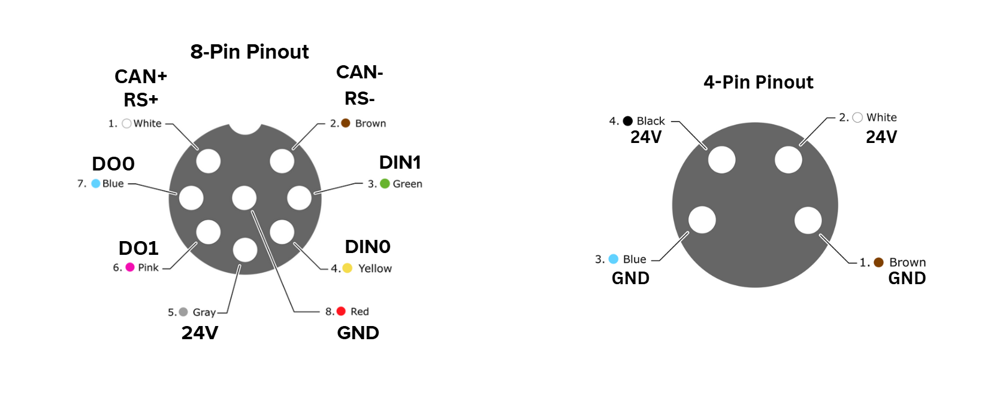

# Python ARTUS Robotic Hand API

A Python API for controlling the ARTUS family of robotic hands (Lite, Lite+, Talos, Scorpion, Dex) by Sarcomere Dynamics Inc., over RS485/Modbus RTU or TCP.

Please contact the team if any issues arise through use of the API. See [Software License](/Software%20License_24March%202025.pdf).

>[!IMPORTANT]
>Please read through this entire README **and** the _User Manual_ before using the ARTUS hand. See the [changelog folder](/changelog/) for release notes and updates.

## Table of Contents
* [Quick Start](#quick-start)
* [Supported Hardware](#supported-hardware)
* [Documentation Map](#documentation-map)
* [1. Getting Started](#1-getting-started)
  * [1.1 Software Requirements](#11-software-requirements)
  * [1.2 Installing the Python API](#12-installing-the-python-api)
  * [1.3 Hardware Requirements](#13-hardware-requirements)
* [2. Basic Usage](#2-basic-usage)
  * [2.1 Normal Startup Procedure](#21-normal-startup-procedure)
  * [2.2 Normal Shutdown Procedure](#22-normal-shutdown-procedure)
  * [2.3 LED States](#23-led-states)
  * [2.4 Running `general_example.py`](#24-running-general_examplepy)
* [3. Control Examples](#3-control-examples)
  * [3.1 GUI](#31-gui)
  * [3.2 Manus Glove Teleoperation](#32-manus-glove-teleoperation)
  * [3.3 MediaPipe Teleoperation](#33-mediapipe-teleoperation)
* [Revision Control](#revision-control)
* [Appendix](#appendix)

## Quick Start

For readers who already know their way around Python and just want the shortest path from clone to a moving joint:

1. Install Python 3.10–3.13.
2. Connect the hand's power harness and USB-C data cable (see [1.3](#13-hardware-requirements)).
3. Set your hand model/port in [`examples/config/robot_config.yaml`](examples/config/README.md).
4. Run [`examples/general_example/general_example.py`](examples/general_example/README.md) and follow the prompts.

Everyone else, continue with [Getting Started](#1-getting-started) below — it walks through each of these steps in detail.

## Supported Hardware

Every hand variant supported by the API has its own README covering wiring, joint maps, and calibration requirements specific to that model. Start there once your hand is connected.

| Hand | Left/Right | Calibration required | Hardware README |
|---|---|---|---|
| ARTUS Lite | Both | No | [ARTUS_LITE.md](/ArtusAPI/robot/artus_lite/ARTUS_LITE.md) |
| ARTUS Lite+ | Both | No | [ARTUS_LITE_PLUS.md](/ArtusAPI/robot/artus_lite/ARTUS_LITE_PLUS.md) |
| ARTUS Talos | Both | **Yes** | [ARTUS_TALOS.MD](/ArtusAPI/robot/artus_talos/ARTUS_TALOS.MD) |
| ARTUS Scorpion | N/A (single DOF gripper) | **Yes** | [ARTUS_SCORPION.md](/ArtusAPI/robot/artus_scorpion/ARTUS_SCORPION.md) |
| ARTUS Dex | Both | No | *hardware README pending — see [`ArtusAPI/robot/artus_dex/`](/ArtusAPI/robot/artus_dex/) source* |

>[!IMPORTANT]
>Talos and Scorpion will not enter an active targeting state until `calibrate()` has been run. See [2.1 Normal Startup Procedure](#21-normal-startup-procedure).

Before updating firmware or the API package, check [docs/COMPATIBILITY.md](docs/COMPATIBILITY.md) for which versions are known to work together.

## Documentation Map

Short guides for navigating the tree — useful if you are new to robotics or to this repo:

| Area | README |
|------|--------|
| Python library layout | [ArtusAPI/README.md](ArtusAPI/README.md) |
| Supported hand models (code + datasheets) | [ArtusAPI/robot/README.md](ArtusAPI/robot/README.md) |
| Runnable sample programs | [examples/README.md](examples/README.md) |
| Configuration file (`robot_config.yaml`) | [examples/config/README.md](examples/config/README.md) |
| Images and saved pose JSON | [data/README.md](data/README.md) |
| Experimental / internal scripts | [test_workspace/README.md](test_workspace/README.md) |
| API notes, CLI / flash docs, firmware compatibility | [docs/README.md](docs/README.md) |
| Release-style notes | [changelog/README.md](changelog/README.md) |
| URDF ↔ real joint mapping | [urdf/README.md](urdf/README.md) |

## 1. Getting Started

The first step to working with an ARTUS hand is connecting to it and achieving joint control and feedback. It is highly recommended that this be done for the first time via the [general example program](#24-running-general_examplepy). The sections below walk through everything needed to get there.

### 1.1 Software Requirements
* **Python 3.10–3.13** — [download here](https://www.python.org/downloads/). On Windows, enable "disable PATH length limit" during setup.
* **FTDI USB driver (Windows only)** — required for the hand to be recognized as a USB device over USB-C. [Download here](https://ftdichip.com/drivers/vcp-drivers/).

>[!NOTE]
>If you have multiple Python installations, make sure your `pip` commands target the same interpreter you'll use to run the API. Prefix commands with the full path to the intended `python.exe`/`python3`, or use a [virtual environment](https://www.freecodecamp.org/news/how-to-setup-virtual-environments-in-python/).

### 1.2 Installing the Python API

There are two ways to install, depending on whether you plan to modify the source.

<!-- **Option A — Use as released (recommended for most users)**
```bash
pip install ArtusAPI
```
This is published on [PyPI](https://pypi.org/project/ArtusAPI/). Make sure you're on the latest version before filing an issue. -->

**Use the cloned repository (for contributors / source changes)**
```bash
git clone <this-repo>
cd Sarcomere_Dynamics_Resources
pip install -r requirements_v2.txt
```

### 1.3 Hardware Requirements

Connect power and data using the supplied cables. Please see robot's exact documentation pages for specific wiring. 

>[!NOTE]
>Wiring may vary by model — always check the [hardware README for your specific hand](#supported-hardware).

<div align=center>
  

  <sub>
    <b>Example wiring for Artus Lite:</b> The diagram above shows the required wiring layout for the Artus Lite hand, including power, ground, and data connections. Always reference your hand model’s specific documentation for any model-specific differences before wiring.
  </sub>
</div>

## 2. Basic Usage

This section covers basic usage via **`ArtusAPI_V2`** (see [`ArtusAPI/artus_api_new.py`](ArtusAPI/artus_api_new.py)), the only supported entry point in this repository.

### 2.1 Normal Startup Procedure

1. **Check hardware** — confirm the power connector is secure and, if using a wired connection (Serial or CANbus), that the cable is good.
2. **Connect** — creating an `ArtusAPI_V2` instance calls `connect()` internally. If you disconnect manually, call `connect()` again before continuing.
3. **Wake up** — call `wake_up()` with the control mode appropriate for your application so the hand loads its configuration and enters a ready state.
4. **Calibrate (if required)** — run `calibrate()` if your model requires it (see [Supported Hardware](#supported-hardware)). Otherwise the hand is ready to accept targets and report feedback.

>[!NOTE]
>Exact `wake_up()` parameters (e.g. position vs. velocity control) depend on your script — see [`examples/general_example/general_example.py`](examples/general_example/general_example.py) and [`docs/API Functionality.md`](docs/API%20Functionality.md).

### 2.2 Normal Shutdown Procedure

1. Send a zero position command to all joints so the hand opens.
2. Once open, call `sleep()` to save parameters to the SD card (if applicable).
3. Wait for the ACK — once received, the device can be powered off.

>[!NOTE]
>Unlike the Artus Lite mk8 (which saved to SD card periodically), saving is now intentional and only happens on `sleep()`.

### 2.3 LED States
See the [hardware README for your specific hand](#supported-hardware).

### 2.4 Running `general_example.py`
See the [General Example README](/examples/general_example/README.md) for full instructions.

## 3. Control Examples

### 3.1 GUI
Desktop UI for interactive testing. See the [Artus GUI README](examples/GUI/README.md).

### 3.2 Manus Glove Teleoperation
Drive an ARTUS hand from a Manus glove in real time. See the [Manus Glove README](examples/Teleoperation/ManusGloveControl/README.md).

### 3.3 MediaPipe Teleoperation
Drive an ARTUS hand from a webcam using Google MediaPipe hand tracking. See the [MediaPipe Control README](examples/Teleoperation/GoogleMediaPipeControl/README.md).

## Revision Control
| Date  | Revision | Changelog | Pip Release |
| :---: | :------: | :---------: | :----------: |
| Jul. 20, 2026 | v2.1 | [2026-07.md](/changelog/2026-07.md) | - |
| Dec. 31, 2025 | v2.0 | [2025-12.md](/changelog/2025-12.md) | - |
| Jun. 2, 2025 | v1.3.10 | [2025-06.md](/changelog/2025-06.md) | v1.3.10 |
| Apr. 22, 2025 | v1.1.1 | readmes/documentation updated | - |
| Nov. 14, 2024 | v1.1 | firmware v1.1 release | v1.1 |
| Oct. 23, 2024 | v1.0.2 | awake parameter added, wake up function in connect | v1.0.1 |
| Oct. 9, 2024 | v1.0 | Artus Lite Release | v1.0 |
| Apr. 23, 2024 | v1.1b | Beta release - Artus Lite Mk 6 | - |
| Nov. 14, 2023 | v1.0b | Initial release - Artus Lite Mk 5 | - |

## Appendix
* [Artus API (`ArtusAPI_V2`)](ArtusAPI/artus_api_new.py) — Main Python class that talks to ARTUS hands (Lite, Lite+, Talos, Scorpion, Dex, and related variants). The legacy v1 `artus_api.py` entry point has been removed from this repository.
* [API Docs](docs/API%20Functionality.md) — Background on the reasoning behind the API's functions.
