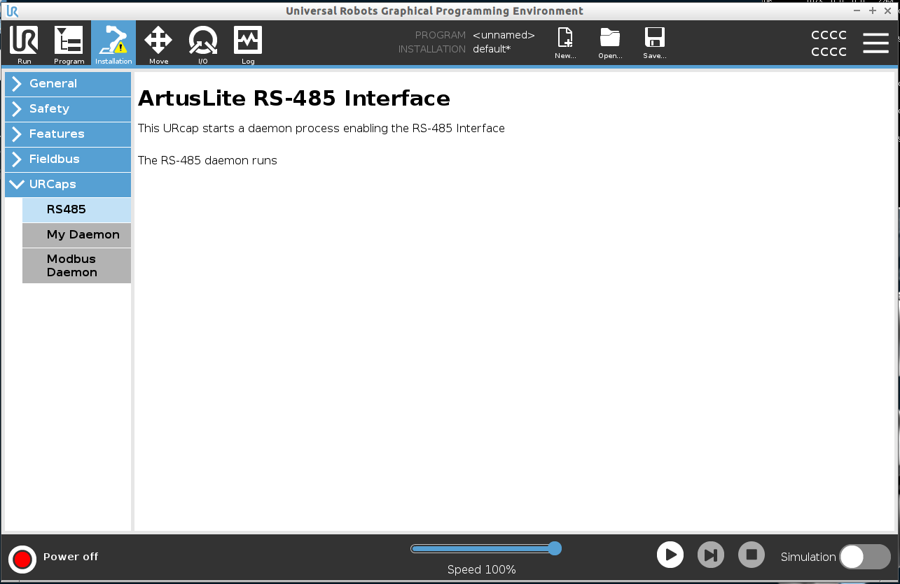

# Controlling Artus Hand on UR Arm

In order to control the Artus Hand on UR Arm, you need to connect the Artus Hand to the UR Arm using the RS485 connector.

After that, setup the software communication on the UR Arm and on the PC.


## 1. Setup on UR Arm

The setup on the UR Arm forwards the RS485 port (/dev/ttyTool) to a TCP port (54329) on the UR Arm.
This allows the PC to communicate with the Artus Hand over the network.

### Method 1: Terminal on UR Arm
1. On the UR Arm control box, install socat using the following command:
```
sudo apt install socat
```

2. Connect the Artus Hand to the UR Arm using the RS485 connetor.
3. Run the following command to forward the UR Arm's RS485 port to the Artus Hand:
```
sudo socat tcp-l:54329,reuseaddr,fork file:/dev/ttyTool,nonblock,raw,b921600,waitlock=/var/run/tty

```

### Method 2: Polyscope on UR Arm
1. Deploy "artuslite_rs485-01.urcap" URCap on polyscope as instructed in the URCap documentation:

    https://github.com/UniversalRobots/Universal_Robots_ROS_Driver/blob/master/ur_robot_driver/doc/install_urcap_e_series.md

    or

    https://www.universal-robots.com/articles/ur/urplus-resources/urcaps-deployment-options/

   

    If the URCap is deployed successfully, you should see the RS485 daemon runs in polyscope as shown in the image below:
    
    
    

## 2. Setup on PC
The setup on the PC creates a temporary port (/tmp/ttyUR) that forwards artus commands to robots over the network.

1. Install socat on PC
```
sudo apt install socat
```
2. Connect the remote PC to the control box using ethernet cable.
<!-- 2. Run the following command on the remote PC to forware COM port to the UR Arm over the network:
```
# Setup your robot IP here:
export ROBOT_IP=192.168.56.101 # IP of the robot
# Setup the name for the device you wish to create. Make sure that your user can write to that location.
export LOCAL_DEVICE_NAME=/tmp/ttyUR
socat pty,link=${LOCAL_DEVICE_NAME},raw,ignoreeof,waitslave tcp:${ROBOT_IP}:54329
```
1. Set the COM port on Artus API with the temporary device name created in the previous step.
```
artus_api = ArtusAPI(comm_port='/tmp/ttyUR')
``` -->
3. Determine UR Robot's IP:

    example:
    ```python
    "192.168.194.129"
    ```
4. open "/examples/other_examples/urarm_rs485_example/urarm_rs485_example.py" file and set the ROBOT_IP to the robot's IP address.

    example:
    ```python
    # Artus API Port Forwarder
    ROBOT_IP = "192.168.194.129"
    artusAPIPortForwarder = ArtusAPIPortForwarder(robot_ip=ROBOT_IP)
    ```


## Troubleshooting
1. If you are unable to connect to the robot, check the IP address of the robot.
2. If sure the socat process is not already running before running the example code.
   If the socat process is already running on your PC, kill the process using the following command:
    ```
    # Find the process ID of the socat process
    ps aux | grep socat
    ```
    ```
    # Kill the process
    sudo kill -9 <process_id>
    ```